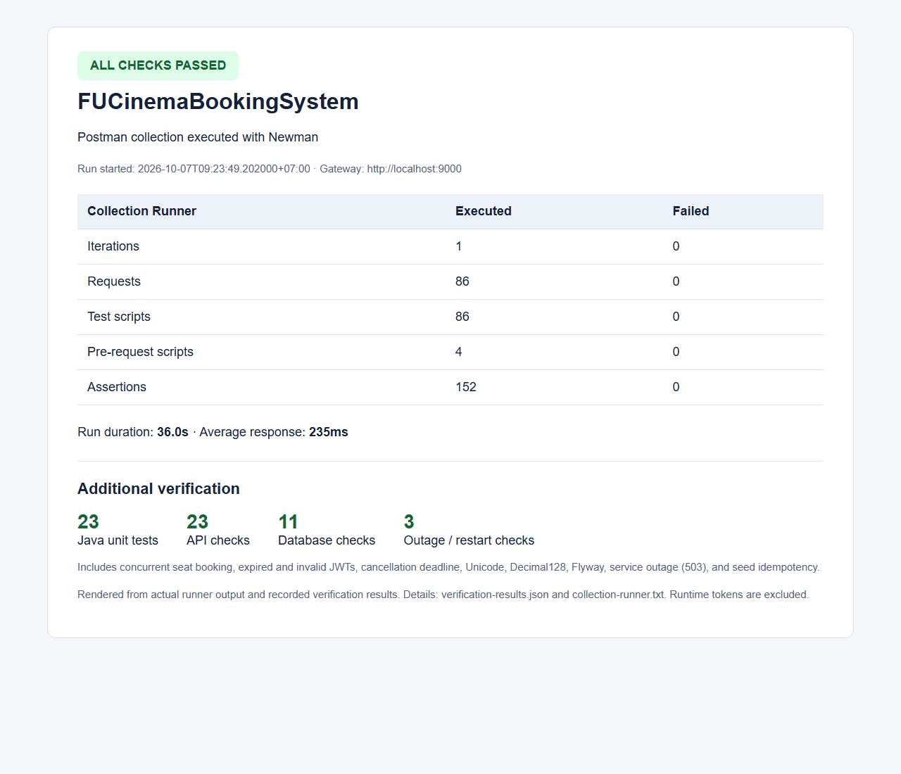

# FUCinemaBookingSystem — Assignment 01

Backend đặt vé xem phim gồm ba microservice và API Gateway. Tất cả API dành cho client đi qua `http://localhost:9000`.

## Công nghệ và cấu trúc

Java 21, Spring Boot 4.1.0, Spring Cloud 2025.1.3, Gateway Server Web MVC, Spring Data JPA/MongoDB, Flyway, OpenFeign, BCrypt và JWT HS256.

| Ứng dụng | Cổng mặc định | Database |
|---|---:|---|
| customer-service | 8081 | SQL Server 2022 / cinema_customer |
| movie-service | 8082 | MongoDB 7.0.5 / cinema_movie |
| booking-service | 8083 | MySQL 8.3.0 / cinema_booking |
| api-gateway | 9000 | Không có database |

Mỗi service theo Controller → Service → Repository, sử dụng DTO record, Bean Validation và JSON lỗi thống nhất. Booking lưu snapshot phim, phòng, giờ chiếu và giá vé. Các ID giữa service là tham chiếu logic; không tạo foreign key giữa database.

## Build và khởi động

Chuẩn bị JDK 21, Docker Desktop đang chạy và Node.js nếu chạy Newman. Đặt `JAVA_HOME` trỏ đến JDK 21 của máy; Maven Wrapper đi kèm nên không cần cài Maven riêng.

Từ thư mục `fu-cinema`, chạy PowerShell:

```powershell
.\mvnw.cmd clean package
docker compose up -d
docker compose ps -a
.\scripts\start.ps1
```

Đợi `cinema-sqlserver` healthy và `cinema-sqlserver-init` Exited (0) trước khi khởi động ứng dụng. MySQL tạo database qua `mysql/init.sql`; SQL Server qua `sqlserver/init.sql`. Flyway tạo bảng và seed customer lúc ứng dụng khởi động. Movie Service chỉ seed từng collection khi collection đó rỗng.

Thứ tự khởi động: database → customer → movie → booking → gateway. Script chạy các ứng dụng ở background, lưu PID và log trong `.runtime/` (đã ignore). Có thể mở từng project Maven trong IntelliJ và chạy lớp `*Application` tương ứng.

Kiểm tra Gateway:

```powershell
Invoke-RestMethod http://localhost:9000/actuator/health
Invoke-RestMethod http://localhost:9000/api/movies
```

Dừng ứng dụng và database mà vẫn giữ dữ liệu:

```powershell
.\scripts\stop.ps1
docker compose down
```

## Tài khoản test

| Vai trò / trạng thái | Email | Mật khẩu |
|---|---|---|
| ADMIN (trong application.properties) | admin@fucinema.com | @@abc123@@ |
| CUSTOMER / ACTIVE | an@gmail.com | 123456 |
| CUSTOMER / ACTIVE | binh@gmail.com | 123456 |
| CUSTOMER / INACTIVE | chi@gmail.com | 123456 |

SQL Server: `sa / Fucinema@2026`; MongoDB: `root / password`; MySQL: `root / mysql`. Đây là tài khoản demo theo đề bài.

`POST /api/auth/login` trả token Bearer; gửi token ở header `Authorization` cho các API cần đăng nhập. Gateway xác minh chữ ký và hạn token, phân quyền ADMIN/CUSTOMER, xóa toàn bộ header `X-User-*` do client gửi rồi chèn context từ JWT. Các service nội bộ tin context do Gateway cung cấp.

## Kiểm thử Postman / Newman

Import hai file trong `postman/`, chọn environment **FUCinema-Local**, chạy collection theo thứ tự folder `01-Auth` → `08-Report`. Token và ID được lưu tự động bởi test script; environment nộp bài không chứa token.

Collection có 86 request kiểm tra authentication, profile, CRUD Admin, catalog, scheduling, booking, ownership, cancellation, seat release và revenue report. Email/tên test được sinh động; hai phòng riêng được tạo để test lịch trùng giờ có thể chạy lại.

Chạy Collection Runner qua CLI của Postman:

```powershell
New-Item -ItemType Directory -Force .runtime | Out-Null
npx --yes newman run postman/FUCinemaBookingSystem.postman_collection.json `
  -e postman/FUCinema-Local.postman_environment.json `
  --reporters cli,json --reporter-json-export .runtime/runner.json `
  --export-environment .runtime/runner.environment.json --timeout-request 10000
```

Kiểm tra bổ sung sau khi collection pass (Python 3, chỉ dùng standard library):

```powershell
python -X utf8 scripts/verify-extra.py
python -X utf8 scripts/verify-databases.py
.\scripts\verify-outage.ps1
```

`verify-extra.py` kiểm tra tranh ghế đồng thời, JWT hết hạn/sai chữ ký, vé null, deadline hủy vé, CRUD và update suất chiếu. `verify-databases.py` kiểm tra tiếng Việt trong SQL Server, Flyway, ObjectId/Decimal128, MongoDB indexes, snapshot và tính toàn vẹn ghế. `verify-outage.ps1` dừng riêng Movie Service, xác nhận đặt vé và seat map trả 503, khởi động lại và đối chiếu số document để bảo đảm seed không nhân đôi.

Ghế đang bán được lưu trong `seat_reservation` với primary key `(showtime_id, seat_code)`. MySQL phân xử hai request tranh ghế; request thua trả 409 và rollback cả booking. Hủy booking xóa reservation trong cùng transaction, giữ booking_detail để xem lịch sử và cho phép đặt lại ghế.

## Kết quả đã xác minh

Ngày kiểm thử: **07/10/2026**, múi giờ Việt Nam. Cả bốn project build thành công với Java 21.

| Nhóm kiểm thử | Kết quả |
|---|---|
| Java unit tests | 23 pass, 0 failure/error |
| Newman Collection Runner | 86 request, 152 assertion, 0 lỗi |
| API bổ sung | 23 pass |
| Database | 11 pass |
| Movie Service outage / restart | 3 pass |

Ảnh dưới được chụp từ trang kết quả dựng bằng dữ liệu kiểm thử thật của Newman; đây là kết quả CLI, không phải ảnh giao diện Postman desktop.



Chi tiết: [kết quả JSON](docs/verification-results.json), [log Collection Runner](docs/collection-runner.txt), [trang kết quả](docs/collection-runner.html).

Máy kiểm thử đã có MongoDB ở 27017 và mongo-express ở 8081. Kiểm thử dùng override local (đã ignore) để ánh xạ MongoDB assignment ở 27018, customer-service ở 8084 và cấu hình Gateway gọi cổng 8084; endpoint client vẫn là 9000. Source mặc định giữ nguyên cổng theo đề. Khi cần tái chạy trên máy này:

```powershell
$env:JAVA_HOME = 'C:\Users\DELL\.jdks\ms-21.0.12.1'
docker compose -f docker-compose.yml -f .runtime/compose.override.yml up -d
.\scripts\start.ps1 -CustomerPort 8084 -MongoPort 27018
# Khi kiểm tra outage, truyền cổng MongoDB đang dùng:
.\scripts\verify-outage.ps1 -MongoPort 27018
```

`Assignment1.md` và `Assignment1_Guide.md` chỉ dùng làm yêu cầu local, đã ignore và không có trong commit. Các commit theo từng TODO dùng Conventional Commits và được push trực tiếp lên `master`.
